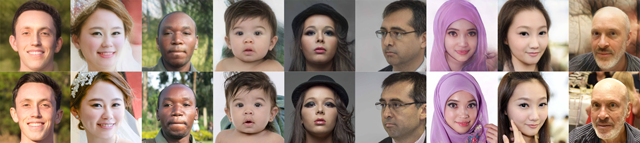
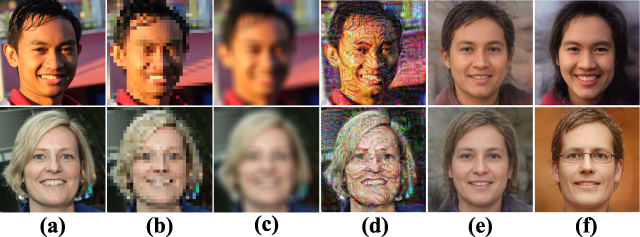
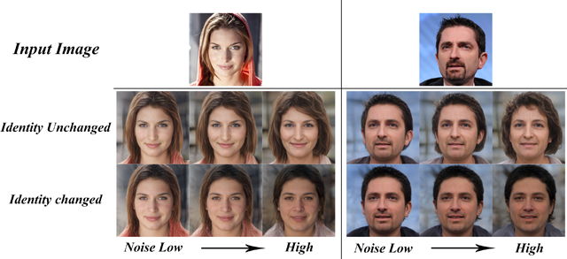
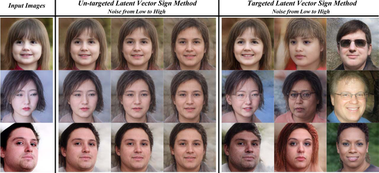

# Face-Adversarial-Autoencoder
This is the repo installing the face adversarial autoencoder. Most of the experiments run on the Colab. This repo contains:
- Introduction
- Codes supply

## Introduction

This method add adversary perturbations on latent space in a forward propogation way to reduce computation comsumimg and enhance AEs transferbility.

<p align="center">

</p>

### Setup

The source of the Encoder is [here](https://github.com/eladrich/pixel2style2pixel). 

The Decoder in this paper is [StyleGAN2](https://github.com/NVlabs/stylegan2).

<p align="center">

</p>

#### Prerequisites
- Linux or macOS
- NVIDIA GPU + CUDA CuDNN (CPU may be possible with some modifications, but is not inherently supported)
- Python 2 or 3

#### Installation
- Clone this repo:
``` 
git clone https://github.com/eladrich/pixel2style2pixel.git
cd pixel2style2pixel
```
- Dependencies:  
We recommend running this repository using [Anaconda](https://docs.anaconda.com/anaconda/install/). 
All dependencies for defining the environment are provided in `environment/psp_env.yaml`. 
Not suggested to use `conda` to install all dependencies in this repo. Use `pip` instead to avoid dependency errors.

#### Inference Notebook
To help visualize the pSp framework on multiple tasks and to help you get started, we provide a Jupyter notebook found in `notebooks/inference_playground.ipynb` that allows one to visualize the various applications of pSp.   
The notebook will download the necessary pretrained models and run inference on the images found in `notebooks/images`.  
For the tasks of conditional image synthesis and super resolution, the notebook also demonstrates pSp's ability to perform multi-modal synthesis using 
style-mixing. 

#### Pretrained Models
Please download the pre-trained models from the following links. Each pSp model contains the entire pSp architecture, including the encoder and decoder weights.
| Path | Description
| :--- | :----------
|[StyleGAN Inversion](https://drive.google.com/file/d/1bMTNWkh5LArlaWSc_wa8VKyq2V42T2z0/view?usp=sharing)  | pSp trained with the FFHQ dataset for StyleGAN inversion.
|[Face Frontalization](https://drive.google.com/file/d/1_S4THAzXb-97DbpXmanjHtXRyKxqjARv/view?usp=sharing)  | pSp trained with the FFHQ dataset for face frontalization.
|[Sketch to Image](https://drive.google.com/file/d/1lB7wk7MwtdxL-LL4Z_T76DuCfk00aSXA/view?usp=sharing)  | pSp trained with the CelebA-HQ dataset for image synthesis from sketches.
|[Segmentation to Image](https://drive.google.com/file/d/1VpEKc6E6yG3xhYuZ0cq8D2_1CbT0Dstz/view?usp=sharing) | pSp trained with the CelebAMask-HQ dataset for image synthesis from segmentation maps.
|[Super Resolution](https://drive.google.com/file/d/1ZpmSXBpJ9pFEov6-jjQstAlfYbkebECu/view?usp=sharing)  | pSp trained with the CelebA-HQ dataset for super resolution (up to x32 down-sampling).
|[Toonify](https://drive.google.com/file/d/1YKoiVuFaqdvzDP5CZaqa3k5phL-VDmyz/view)  | pSp trained with the FFHQ dataset for toonification using StyleGAN generator from [Doron Adler](https://linktr.ee/Norod78) and [Justin Pinkney](https://www.justinpinkney.com/).

If you wish to use one of the pretrained models for training or inference, you may do so using the flag `--checkpoint_path`.

In addition, we provide various auxiliary models needed for training your own pSp model from scratch as well as pretrained models needed for computing the ID metrics reported in the paper.
| Path | Description
| :--- | :----------
|[FFHQ StyleGAN](https://drive.google.com/file/d/1EM87UquaoQmk17Q8d5kYIAHqu0dkYqdT/view?usp=sharing) | StyleGAN model pretrained on FFHQ taken from [rosinality](https://github.com/rosinality/stylegan2-pytorch) with 1024x1024 output resolution.
|[IR-SE50 Model](https://drive.google.com/file/d/1KW7bjndL3QG3sxBbZxreGHigcCCpsDgn/view?usp=sharing) | Pretrained IR-SE50 model taken from [TreB1eN](https://github.com/TreB1eN/InsightFace_Pytorch) for use in our ID loss during pSp training.
|[CurricularFace Backbone](https://drive.google.com/file/d/1f4IwVa2-Bn9vWLwB-bUwm53U_MlvinAj/view?usp=sharing)  | Pretrained CurricularFace model taken from [HuangYG123](https://github.com/HuangYG123/CurricularFace) for use in ID similarity metric computation.
|[MTCNN](https://drive.google.com/file/d/1tJ7ih-wbCO6zc3JhI_1ZGjmwXKKaPlja/view?usp=sharing)  | Weights for MTCNN model taken from [TreB1eN](https://github.com/TreB1eN/InsightFace_Pytorch) for use in ID similarity metric computation. (Unpack the tar.gz to extract the 3 model weights.)

By default, we assume that all auxiliary models are downloaded and saved to the directory `pretrained_models`. However, you may use your own paths by changing the necessary values in `configs/path_configs.py`. 

### Data set

This repo uses a subset of [FFHQ](https://drive.google.com/drive/folders/1tZUcXDBeOibC6jcMCtgRRz67pzrAHeHL) dataset. We generated 11k image latent code for experiments. (The file `latent_11k.npy` is saved on [Drive](https://drive.google.com/file/d/1wkTijbLQ3x5WETYejxqNDZmh4LlJISGs/view?usp=sharing))

### How to use

To generate the latent code for your dataset, use `notebooks/Generate_latent_code.ipynb` as a reference.

To test the results, use `notebooks/latent2image2latent_exps.ipynb` as a reference.

## Results

<p align="center">



</p>
